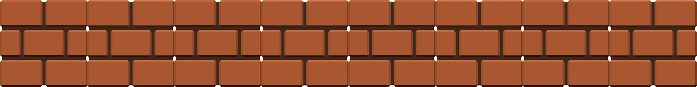
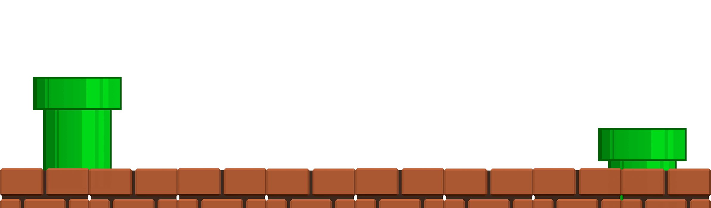

  

  

  

  

 

  

  

  

<picture>
  <source media="(prefers-color-scheme: dark)" srcset="images/github-user-contribution-dark.svg" />
  <source media="(prefers-color-scheme: light)" srcset="images/github-user-contribution-light.svg" />
  
</picture>

